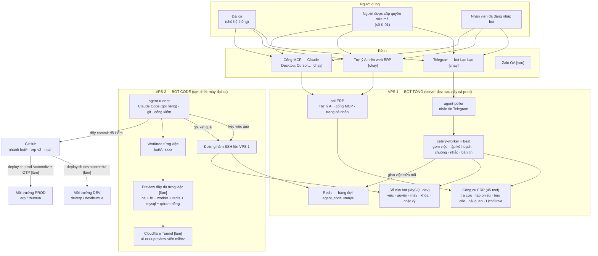
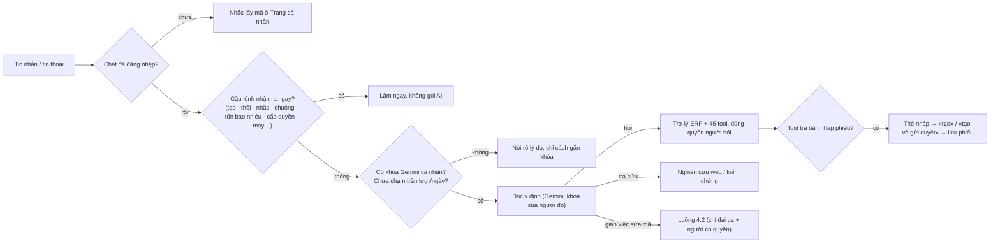
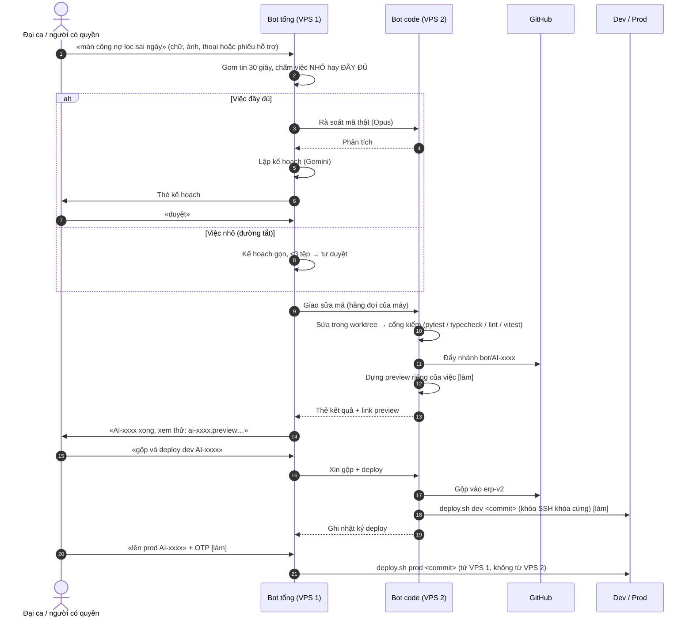

# AGENT HUB — QUY TRÌNH VÀ SƠ ĐỒ BOT TRỢ LÝ

**Bản 1.0 · 05/10/2026 · ai-CR-065.** Tài liệu tổng hợp một chỗ: bot gồm những phần nào, nằm ở đâu, ai được
làm gì, và từng luồng chạy ra sao. Chi tiết từng phần xem: thiết kế [`01`](./01-thiet-ke-ky-thuat.md),
danh sách tính năng + lộ trình [`04`](./04-danh-sach-tinh-nang.md), máy sửa mã [`05`](./05-may-sua-ma.md),
cổng MCP [`06`](./06-cong-mcp.md).

Ký hiệu trạng thái: **[chạy]** đã chạy trên dev · **[làm]** đã chốt thiết kế, đang/sắp làm · **[sau]** để sau.

---

## 1. Ý tưởng một câu

Có **một bot tổng** (VPS 1) nói chuyện với mọi người và gọi mọi công cụ ERP; **riêng việc sửa mã** thì bot tổng
không tự làm mà **giao xuống bot code** (VPS 2), nơi duy nhất có Claude Code và khóa GitHub. Bot code sửa, kiểm,
dựng bản xem thử; đại ca thử xong thì ra lệnh đẩy lên dev hoặc prod. Thêm máy, thêm môi trường chỉ là thêm dòng
trong sổ, quy trình không đổi — kể cả khi bot tự sửa chính nó.

## 2. Sơ đồ tổ chức

**Ai giữ chìa khóa gì**

| Nơi | Giữ | KHÔNG giữ |
|---|---|---|
| VPS 1 — bot tổng | Token Telegram, khóa Gemini cá nhân của từng người (mã hóa), token Google từng người (mã hóa), khóa MCP (băm) | Claude Code, khóa GitHub, khóa SSH prod |
| VPS 2 — bot code | Claude Code (tài khoản riêng của công ty), khóa GitHub chỉ đẩy `bot/*` + `erp-v2`, khóa SSH đường hầm (chỉ mở cổng), tài khoản MySQL `agent_runner` (chỉ bảng của bot) | Token Telegram, khóa Gemini, khóa SSH prod |
| Đại ca | Quyền duyệt cuối, mã xác nhận lên prod (OTP) | — |

## 3. Vai trò và quyền

| Ai | Làm được | Không làm được |
|---|---|---|
| **Nhân viên** đã `/dangnhap` | Hỏi Trợ lý dưới đúng quyền ERP của mình; tạo / gửi duyệt phiếu từ chat; nghiên cứu; nhắc việc; tin thoại; chuông; Lịch/Drive của mình; khóa MCP của mình; báo lỗi | Giao việc sửa mã; thấy dữ liệu ngoài quyền |
| **Người được cấp quyền** (đại ca nhắn «cho anh X quyền …») | Thêm: lệnh trên việc sửa mã theo cấp — *duyệt kế hoạch* (duyệt, sửa kế hoạch, làm tiếp, đóng) hoặc *gộp dev* (thêm gộp, deploy dev, thu hồi). Phải nêu mã việc | Lên prod; cấp quyền cho người khác |
| **Đại ca** | Mọi thứ; cấp/gỡ quyền; thêm/gỡ máy; thêm môi trường; duyệt thao tác trên VPS 1; lên prod (kèm OTP) | — |
| **Bot tổng** | Gọi công cụ ERP dưới quyền người hỏi; xếp việc; gửi tin | Sửa mã; chạy lệnh trên máy |
| **Bot code** | Sửa mã trong worktree; chạy kiểm; dựng preview; xin deploy | Tự sửa phần quyền / OTP / danh sách tệp cấm của chính nó; lên prod khi chưa duyệt |

## 4. Các luồng

### 4.1 Tin nhắn thường (hỏi, tạo phiếu, nhắc việc…) — [chạy]

Chạy nền theo lịch (không cần ai nhắn): **chuông ERP** → Telegram mỗi phút; **lời nhắc** tới giờ; **bản tin sáng**
7h30 (lịch + việc chờ duyệt); **nhắc trước họp** 15 phút; **nhặt phiếu hỗ trợ** thành việc sửa mã.

### 4.2 Việc sửa mã — [chạy]

Máy sửa mã tắt thì việc nằm chờ trong hàng đợi, bot báo «đang chờ máy X». Việc **dính máy** đã bắt đầu nó.
Model: việc nhỏ `claude-opus-5`, việc đầy đủ `claude-opus-5-5` (đặt trong `.env.runner`).

### 4.3 Bản xem thử (preview) — [làm]

- Mỗi việc kiểm xanh → một bộ stack ĐẦY ĐỦ riêng (backend, frontend, worker, redis, MySQL, qdrant) trên VPS 2, dữ
  liệu tự seed như local, địa chỉ `ai-xxxx.preview.<tên miền>` qua Cloudflare Tunnel.
- Máy hiện tại: 1 bộ một lúc. VPS preview riêng (8 vCPU / 16 GB): 2–3 bộ cùng lúc. Tự tắt khi việc đóng hoặc sau 24 giờ.
- **Để sau:** chép DB dev sang preview khi cần test với dữ liệu thật.

### 4.4 Bot code thao tác trên VPS 1 — [làm]

| Thao tác | Duyệt | Bảo vệ |
|---|---|---|
| Xem dữ liệu / log dev | Không | MySQL chỉ đọc, ghi nhật ký |
| Xem dữ liệu prod | «đúng» | Ghi nhật ký |
| Sửa dữ liệu / chạy lệnh dev | «đúng» | Thẻ hiện nguyên văn lệnh → **sao lưu trước** → chạy → nhật ký + **lệnh hoàn tác** |
| Mọi thay đổi prod | «đúng» + **OTP** | Như trên |

«hoàn tác thao tác #12» → bot chạy lệnh hoàn tác đã ghi. «lịch sử thao tác prod» → liệt kê.

### 4.5 Bot tự cải thiện — [chạy, thêm luật ở bước làm]

Mã của bot nằm cùng kho, nên «sửa bot» là một việc sửa mã như mọi việc khác (AI-0001 chính là bot sửa giao diện
của bot). Ba luật cứng thi hành trong mã: bot code **không** được sửa sổ quyền, phần OTP / lệnh lên prod, và danh sách
tệp cấm sửa; mọi thay đổi qua cổng kiểm + đại ca duyệt; lên prod luôn cần OTP.

### 4.6 Mở rộng — sổ môi trường và sổ máy

- **Sổ máy** [chạy]: «thêm máy của anh Được» · «máy nào đang bật» · «AI-0012 cho máy X làm» · «cho máy X được deploy».
- **Sổ môi trường** [làm]: «thêm môi trường staging: vps …, nhánh …, lệnh deploy …» → bot tổng ghi, truyền cho bot code
  mỗi lần giao việc. Thêm VPS thứ 3, 4 = thêm dòng.
- **Báo tài nguyên** [làm]: mỗi ngày RAM/CPU/đĩa từng máy, số việc, lượt Claude/Gemini, việc kẹt; hỏi «tình hình máy».

## 5. Trạng thái tổng (05/10/2026)

| Phase | Nội dung | Trạng thái |
|---|---|---|
| 0–2 | Bot sửa mã, đăng nhập, khóa cá nhân, bot lên dev, máy sửa mã tách rời, đường tắt | [chạy] |
| 3 | Chuông, nhắc việc, tin thoại, trần lượt | [chạy] |
| 4 | Cổng MCP | [chạy], chưa ai thử bằng ứng dụng thật |
| 5 | Google cá nhân: Lịch, Drive, bản tin sáng, nhắc họp | Mã đã lên dev; chờ đại ca: redirect URI, «In production», `GOOGLE_CLIENT_SECRET` |
| **6** | Quy trình code hai máy chủ (nhóm V): sổ môi trường, `deploy.sh` + nhật ký, thao tác VPS 1 có duyệt/sao lưu/hoàn tác, OTP, 3 luật, báo tài nguyên, preview | [làm] — tiếp theo |
| **7** | Tự vận hành (nhóm O): theo dõi sức khỏe, tự chẩn đoán, tự khôi phục dev, prod chỉ đề xuất, sổ sự cố | [làm] sau phase 6 |
| **8** | Lõi mở: gọi MCP bên ngoài, A2A giữa các bot, giao việc tính ngân sách, sổ sự kiện chung | [sau] |
| 9 | Zalo OA, nhiều bot | [sau] — chờ OA + tên bot |
| 10 | Thư ký biên bản họp | [sau] — chờ tệp ghi âm thật |

## 6. Đối chiếu với các mô hình bên ngoài (05/10/2026)

Mô hình của hệ là **orchestrator – worker** (điều phối – thực thi), một trong các mẫu trong bài «Building Effective Agents»
của Anthropic, đi cùng **tool calling / MCP** (agent dùng công cụ) và sắp tới **A2A** (agent nói chuyện với agent). Hệ là
**agentic**: tự lên kế hoạch, gọi công cụ, làm nhiều bước. Nguyên tắc: **chỉ học ý tưởng, không clone thay lõi** — phần
khó nhất (quyền ERP từng người, phạm vi dữ liệu, khóa cá nhân, sổ việc, chi phí) các khung chung không có.

| Tiêu chí | Thông lệ ở các khung mở (mcp-agent, Agent Swarm, cli-agent-orchestrator, OpenAI Agents SDK) | Hệ mình |
|---|---|---|
| Điều phối – thực thi | Lead / supervisor giao cho worker | Có: bot tổng → bot code, sổ máy, việc dính máy |
| Công cụ qua chuẩn chung | MCP client gọi công cụ ngoài | Một nửa: có cổng MCP **mở ra** (`06`); **gọi vào** công cụ MCP ngoài chưa có → M-09 |
| Agent nói chuyện với agent | A2A | Chưa; đang dùng hàng đợi Redis tự viết → N-06 |
| Người duyệt ở chỗ nguy hiểm (HITL) | Cổng duyệt trong luồng | Có: duyệt kế hoạch, gộp, sổ quyền; thêm OTP prod + duyệt thao tác → V-03, V-04 |
| Worker cách ly | Docker / worktree riêng từng việc | Có: worktree riêng, runner không giữ token bot; preview riêng → V-07 |
| Theo dõi, truy vết | Sổ sự kiện / trace | Có sổ tin + sổ lượt chạy; gom một khuôn → N-08 |
| Ngân sách | Theo dõi token, chặn khi quá | Có trần lượt/ngày theo người, báo chi phí; giao việc theo ngân sách → N-07 |
| Tự vận hành | Ít khung có sẵn | Chưa → nhóm O |
| Quyền theo người dùng thật | Hầu như không có | **Có — điểm mạnh riêng** (chạy dưới quyền ERP của từng người, khóa cá nhân) |

Giấy phép khi mượn mã: MIT / Apache 2.0 dùng được (giữ giấy phép, ghi nguồn); **AGPL tránh**; kho không ghi giấy phép
chỉ đọc để học.
