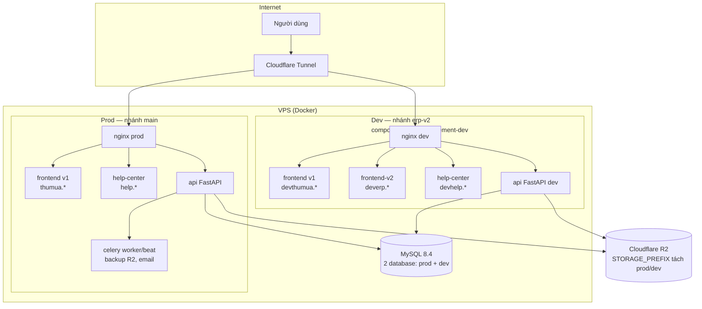
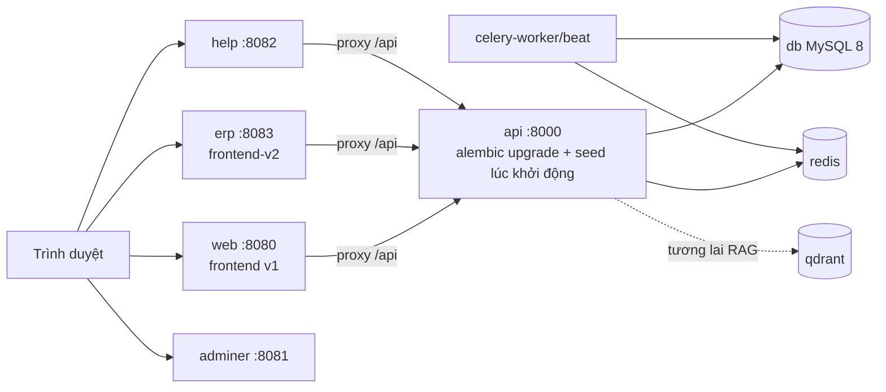
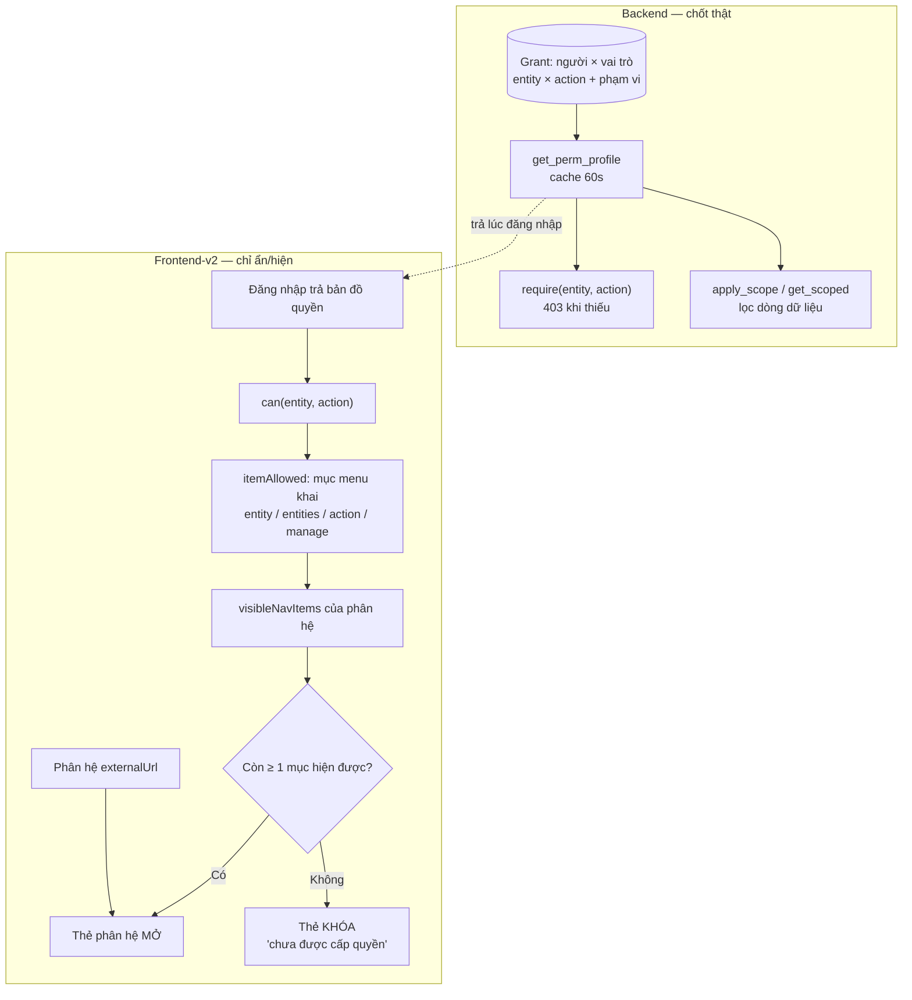

# SƠ ĐỒ KIẾN TRÚC — ERP V2

Bản 1.0 — 28/08/2026. Xem trực tiếp trên GitHub/VS Code (Mermaid). Sơ đồ vẽ mức khối,
tên container/domain lấy theo thực tế VPS; lệnh deploy chính xác đọc
[`quy-trinh-nhanh-va-deploy.md`](../../tai-lieu-ky-thuat/quy-trinh-nhanh-va-deploy.md).

## 1. Triển khai — ba môi trường

Hai quy tắc sống còn: deploy prod **bắt buộc** `-f docker-compose.production.yml` (thiếu là 502);
cập nhật mã trên VPS bằng `git fetch` + `git reset --hard origin/<nhánh>`, không `pull`
(hai worktree chung một repo). Dev tắt email thật bằng `EMAIL_HARD_OFF`.

## 2. Local — một compose đủ cả hệ

## 3. Từ quyền trong DB tới thẻ phân hệ trên màn hình

Đọc kèm [`03-phan-quyen-va-hien-thi.md`](03-phan-quyen-va-hien-thi.md): mục menu quên khai khóa
là nhánh "Còn ≥ 1 mục" luôn đúng — chính là lỗi CR-196, đã có test canh.
