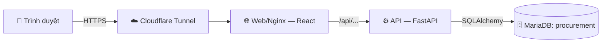
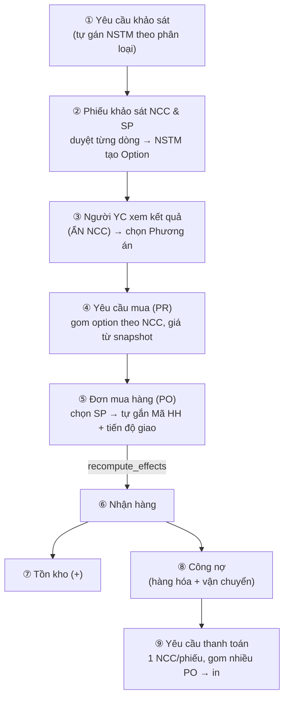

# TÀI LIỆU THIẾT KẾ KỸ THUẬT (Technical Design Document — TDD)
## Mini Tool Quản lý Thu Mua — DEGO Holding

| | |
|---|---|
| **Phiên bản** | v1.0 (baseline đề xuất) |
| **Ngày** | 2026-07-08 |
| **Trạng thái** | 🟡 Draft — chờ chốt (sign-off) |
| **Chủ sở hữu tài liệu** | Team Product/Kỹ thuật |
| **Khách hàng / nghiệp vụ** | Phòng Thu mua |
| **Sản phẩm** | Web app nội bộ quản lý quy trình thu mua (khảo sát → mua → nhận → công nợ → thanh toán) |

> Đây là **"bản vẽ"** đã chốt của hệ thống. Mọi thay đổi so với bản này phải đi qua **Change Request (phụ lục)** — xem [quy-trinh-tai-lieu.md](quy-trinh-tai-lieu.md) và mục 12.

---

## Mục lục
1. Mục tiêu & phạm vi
2. Vai trò người dùng (Actors)
3. Kiến trúc tổng thể
4. **Luồng nghiệp vụ end-to-end** (bản vẽ chính)
5. Danh sách module & chức năng
6. Mô hình dữ liệu (Data model)
7. Phân quyền (RBAC)
8. Quy tắc nghiệp vụ quan trọng
9. Tích hợp & đồng bộ
10. Yêu cầu phi chức năng
11. Triển khai (Deployment)
12. Nhật ký thay đổi & phiên bản

---

## 1. Mục tiêu & phạm vi

### 1.1 Mục tiêu
Số hóa quy trình thu mua của DEGO Holding: từ **yêu cầu khảo sát** nhà cung cấp/sản phẩm → **khảo sát** → **yêu cầu mua** → **đơn mua (PO)** → **nhận hàng** → **công nợ** → **yêu cầu thanh toán**, kèm **báo cáo** và **phân quyền** theo vai trò/phòng ban.

### 1.2 Trong phạm vi (In scope)
- Quản lý danh mục: Sản phẩm (VTBB/NL + liên kết Mã HH), Nhà cung cấp, Công ty/Pháp nhân, Phòng ban, Nhân viên, Kho, ĐVT, Phân loại, Thương hiệu.
- Nghiệp vụ: Yêu cầu khảo sát, Phiếu khảo sát (NCC & Sản phẩm), Yêu cầu mua, Đơn mua hàng (PO), Nhận hàng, Tồn kho, Công nợ, Yêu cầu thanh toán, Hợp đồng, Báo cáo, Dashboard.
- Phân quyền theo vai trò + phạm vi dữ liệu (own/dept/company/proc/all).
- In ấn: PO, Phiếu yêu cầu thanh toán, Yêu cầu mua.

### 1.3 Ngoài phạm vi (Out of scope) — *cần ghi rõ để tránh hiểu lầm*
- Không tích hợp trực tiếp phần mềm kế toán MISA (chỉ lưu mã tham chiếu `misa_code`).
- Không xử lý thanh toán/ngân hàng thực tế (chỉ lập phiếu).
- Không quản lý sản xuất/BOM.
- Đồng bộ Sản phẩm là **1 chiều** (import từ file sheet), chưa 2 chiều realtime.

---

## 2. Vai trò người dùng (Actors)

| Vai trò | Mô tả | Phạm vi dữ liệu điển hình |
|---|---|---|
| **Người yêu cầu** (NV cơ bản) | Tạo yêu cầu khảo sát / yêu cầu mua của mình | `own` (của mình) |
| **Trưởng phòng** | Duyệt yêu cầu của phòng | `dept` (phòng) |
| **Nhân sự thu mua (NSTM)** | Khảo sát, xử lý yêu cầu khảo sát, tạo PO | `proc`/`assigned` (được giao) |
| **Quản lý thu mua** | Duyệt, phân bổ, hủy, hoàn thành | `all` |
| **Admin hệ thống** | Toàn quyền + cấu hình, phân quyền | `all` |

---

## 3. Kiến trúc tổng thể

> Sơ đồ đầy đủ (kiến trúc, use-case, luồng, state, ERD, sequence) ở **[so-do-ky-thuat.md](so-do-ky-thuat.md)**.

| Lớp | Công nghệ |
|---|---|
| Frontend | React 18 + Vite + TypeScript; danh sách/chi tiết cấu hình hóa (`cruds.tsx`); `AuthContext.can(entity, action)`; react-select (autocomplete) |
| Backend | FastAPI + Uvicorn; SQLAlchemy 2.0 (`Mapped`/`mapped_column`); Pydantic v2; Alembic (migration) |
| DB | MariaDB/MySQL (dùng chung với hệ ERP, DB riêng `procurement`) |
| Auth | JWT; khóa mã hóa Fernet (`JWT_SECRET`); đăng nhập bằng **Mã nhân viên** hoặc **Email** |
| Hạ tầng | Docker Compose (dev: mount code + hot reload; prod: image build sẵn); Cloudflare Tunnel; domain `thumua.degoholding.vn` |

**Cấu trúc mã nguồn (chuẩn module):** mỗi nghiệp vụ 1 thư mục `app/modules/<feature>/` gồm `model.py` (bảng), `schema.py` (Pydantic in/out), `service.py` (logic), `controller.py` (route API).

---

## 4. Luồng nghiệp vụ end-to-end — **BẢN VẼ CHÍNH** ⭐

> Đây là phần **hay thay đổi nhất** (VD: input trước là *Yêu cầu mua*, nay là *Yêu cầu khảo sát*). Mọi thay đổi luồng = **Change Request**.
> Bản swimlane theo vai trò + state machine ở **[so-do-ky-thuat.md](so-do-ky-thuat.md)** (mục 3–5).

**Điểm mấu chốt kỹ thuật:** khi nhận hàng, hàm `po_service.recompute_effects(db, po, user)` sinh **đồng bộ**: Phiếu nhập (goods receipt) + cập nhật **tồn kho** (`inv_service.apply_delivery`) + **công nợ** 2 luồng (`pay_service.upsert`: tiền hàng + tiền vận chuyển). *Không được* ghi thẳng bản ghi giao hàng mà bỏ qua hàm này (sẽ mất tồn/công nợ).

---

## 5. Danh sách module & chức năng

| # | Module | API prefix | Chức năng chính | Trạng thái |
|---|---|---|---|---|
| 1 | Sản phẩm | `/api/products` | Master VTBB/NL + Mã HH/Tên HH; import/export CSV; đồng bộ sheet | ✅ |
| 2 | Nhà cung cấp | `/api/suppliers` | NCC hàng hóa / vận chuyển | ✅ |
| 3 | Yêu cầu khảo sát | `/api/survey-requests` | Tạo YC → tự gán NSTM → tạo option → chọn PA → gom PR | ✅ (5A–5D) |
| 4 | Phiếu khảo sát | `/api/surveys` | Khảo sát NCC & SP; duyệt từng dòng | ✅ |
| 5 | Yêu cầu mua | `/api/purchase-requests` | PYC; phân quyền/scope; phân bổ NSTM | ✅ |
| 6 | Đơn mua hàng | `/api/purchase-orders` | PO + items + tiến độ giao; in PO; tự gắn Mã HH | ✅ |
| 7 | Nhận hàng | `/api/inventory` (ngầm) | Goods receipt sinh khi nhận | ✅ |
| 8 | Tồn kho | `/api/inventory` | Tồn + điều chỉnh | ✅ |
| 9 | Công nợ | `/api/payables` | Sinh tự động 2 luồng; tuổi nợ | ✅ |
| 10 | Yêu cầu thanh toán | `/api/payment-requests` | 1 NCC/phiếu, gom PO, in | ✅ |
| 11 | Hợp đồng | `/api/contracts` | Quản lý hợp đồng NCC | ✅ |
| 12 | Báo cáo | `/api/reports`, `/api/survey-report` | Báo cáo thu mua, khảo sát | ✅ |
| 13 | Dashboard | `/api/dashboard` | KPI + việc cần xử lý (theo quyền) | ✅ |
| 14 | Cảnh báo / Thông báo | `/api/alerts`, `/api/notifications` | Nhắc việc (bell) | ✅ |
| 15 | Danh mục nền | companies, departments, employees, warehouses, units, item-groups, brands | Dữ liệu nền | ✅ |
| 16 | Phân quyền | `/api/roles`, `/api/users` | Vai trò + quyền + scope | ✅ |
| 17 | Phân công phụ trách | `/api/category-assignees` | Gán NSTM theo phân loại (tự gán YCKS) | ✅ |
| 18 | Nhật ký (Audit) | `/api/audit-logs` | Ghi vết thao tác | ✅ |

---

## 6. Mô hình dữ liệu (Data model — thực thể chính)

| Thực thể | Bảng | Ghi chú khóa |
|---|---|---|
| Sản phẩm | `tab_product` | `code` (VTBB/NL), `hh_code`/`hh_name` (liên kết Mã HH), `item_group`, `unit` |
| Nhà cung cấp | `tab_supplier` | loại: hàng hóa / vận chuyển |
| Yêu cầu khảo sát | (survey_request: 3 bảng) | header + dòng SP + option (kèm snapshot NCC ẩn với người YC) |
| Phiếu khảo sát | (survey) | header + dòng; duyệt theo dòng (`line_approve = "Đã duyệt"`) |
| Yêu cầu mua | (purchase_request) | header + dòng |
| Đơn mua hàng | `tab_purchase_order` + `tab_po_item` + `tab_po_delivery` | item có `fg_code`/`fg_name` (Mã/Tên HH); delivery ghi nhận từng lần giao |
| Nhận hàng | (goods_receipt) | sinh từ delivery đã nhận |
| Tồn kho | (inventory) | +/- theo nhận hàng & điều chỉnh |
| Công nợ | (payable) | 2 luồng: tiền hàng + tiền vận chuyển |
| Yêu cầu thanh toán | (payment_request) | 1 NCC/phiếu, gom nhiều PO |

> Chi tiết cột xem trực tiếp `backend/app/modules/<feature>/model.py`.

---

## 7. Phân quyền (RBAC)

- **Mô hình:** `require(entity, action)` chặn ở API; `apply_scope(query, model, entity, user, profile)` lọc dữ liệu theo phạm vi.
- **Hành động:** `read, create, write, approve, cancel, delete`.
- **Cấp phạm vi (scope):** `own` (của mình) < `dept` (phòng) < `company` (pháp nhân) < `proc` (thu mua) < `all` (tất cả).
- **Người thu mua** (`is_purchaser`): có scope `proc`/`all` trên `survey_request` → thấy NCC; người thường bị **ẩn NCC** ở màn kết quả khảo sát.
- Quyền lưu trong DB theo vai trò; FE cache ở `localStorage`. **Đổi quyền → phải đăng nhập lại.**

---

## 8. Quy tắc nghiệp vụ quan trọng

1. **Trạng thái dòng YC khảo sát là dẫn xuất** (tự tính), không bật/tắt tay: có option>0 → *Đã khảo sát*; đã chọn PA → *Đã chọn PA*; hoàn thành → *Hoàn thành*.
2. **Xóa option:** còn xóa được cho tới khi tạo thành Yêu cầu mua; sau đó khóa.
3. **Chỉ dòng khảo sát `line_approve = "Đã duyệt"`** mới được tạo option (đúng chuỗi giá trị, không phải "Duyệt").
4. **Ẩn NCC:** serializer kết quả khảo sát dùng **whitelist**, không bao giờ lộ `supplier_*`, `nstm_note`, mã nội bộ… cho người không phải thu mua.
5. **Nhận hàng phải qua `recompute_effects`** để đồng bộ tồn + công nợ.
6. **Yêu cầu thanh toán:** mỗi phiếu chỉ 1 NCC, gom nhiều PO.
7. **ĐVT** không cố định ở master sản phẩm (phụ thuộc NCC) → nhập tại dòng khảo sát/PO.

---

## 9. Tích hợp & đồng bộ

- **Đồng bộ Sản phẩm:** import CSV từ sheet *2. DATA NL, VTBB*. Xử lý: tự bỏ dòng tiêu đề, map header linh hoạt, gộp mã trùng, chuẩn hóa Phân loại (`[Nhãn]→Nhãn`, `HỘP→Hộp`, `Nguyên liệu→NL`), làm sạch `#N/A`, **update-only-if-present** (không xóa nhầm cột không sync). Idempotent (re-import không tạo trùng).
- **Mã MISA:** chỉ lưu tham chiếu (`misa_code`), không đồng bộ tự động.

---

## 10. Yêu cầu phi chức năng

| Nhóm | Yêu cầu |
|---|---|
| Bảo mật | JWT + Fernet; `JWT_SECRET` là khóa master (không đổi); secret chỉ trong `.env`/DB mã hóa, không đưa vào repo |
| Hiệu năng | Danh mục lớn (6.760+ SP) → chọn SP bằng **autocomplete tìm server-side**, không đổ toàn bộ dropdown |
| Ghi vết | Audit log các thao tác chính |
| Sao lưu | DB chung hệ ERP, theo chính sách backup hạ tầng |
| Ngôn ngữ | Tiếng Việt (UTF-8) toàn hệ thống |

---

## 11. Triển khai (Deployment)

| Môi trường | Chi tiết |
|---|---|
| Dev (local) | Docker Compose, mount code + hot reload; DB `mysql:8` container |
| Production (VPS) | `docker-compose.production.yml` (image build sẵn); MariaDB dùng chung; Cloudflare Tunnel; domain `thumua.degoholding.vn` |
| Quy trình deploy | `git pull origin bao` → `docker compose -f docker-compose.production.yml up -d --build` → migration Alembic chạy khi khởi động |
| Nhánh git | `flow-v2` (làm việc) → merge `bao` (deploy) → push origin |

---

## 12. Nhật ký thay đổi & phiên bản

> Baseline = v1.0. Mỗi thay đổi so với baseline → 1 dòng ở **[change-log.md](change-log.md)** với ước lượng ảnh hưởng + người duyệt, rồi tăng version.

| Version | Ngày | Nội dung | Người duyệt |
|---|---|---|---|
| v1.0 | 2026-07-08 | Baseline đầu tiên (tài liệu hiện tại) | ☐ chờ ký |

**Ví dụ Change Request đã xảy ra (cần đưa vào change-log khi chốt):**
- *CR-001:* Đổi input quy trình từ **Yêu cầu mua** → **Yêu cầu khảo sát** (phòng TM muốn khảo sát trước khi mua). Ảnh hưởng: thêm module Yêu cầu khảo sát (5A–5D), 3+ màn, tự gán NSTM, cơ chế ẩn NCC.

---

*Hết tài liệu v1.0. Xem quy trình vận hành tài liệu tại [quy-trinh-tai-lieu.md](quy-trinh-tai-lieu.md).*
